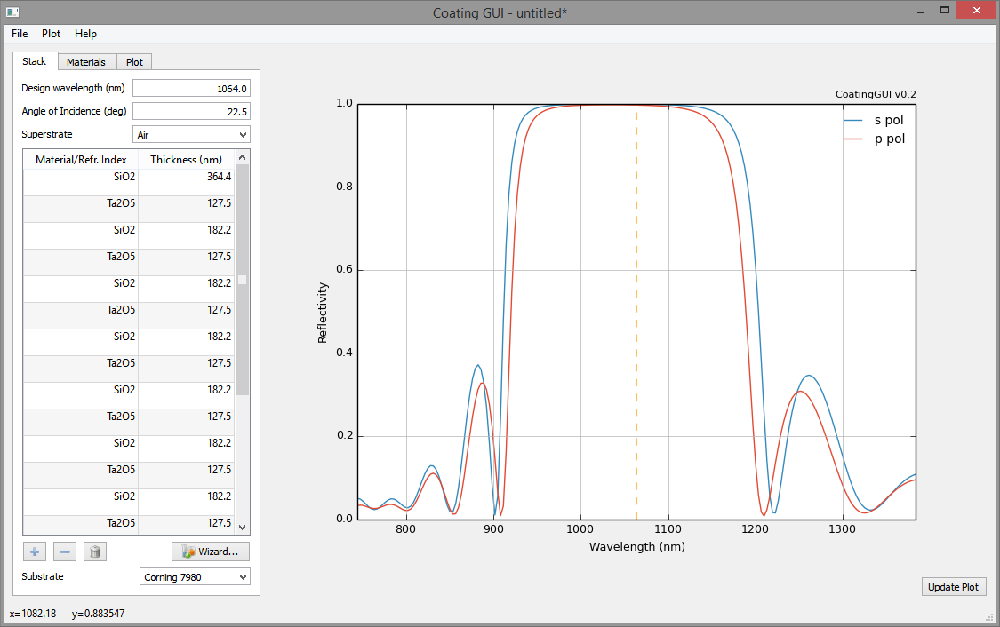

dielectric / CoatingGUI
=======================

Dielectric mirror coating simulation tool

The goal of this project is to provide an easy interface for coating simulations,
tailored to the needs of the gravitational wave community. Especially, this means
that this project is focussed on rather simple (design-wise) single-wavelength
coatings rather than e.g. dispersion-optimised coatings. However, it will (at some
point) include coating thermal noise calculations.

Status
------
- rudimentary work flow implemented
- optical part more or less complete
- thermal noise calculations missing
- graphical output still leaves many things to be desired

Screenshots
-----------

Plot of reflectivity vs. wavelength for a multi-layer, quarter-wave stack HR coating.

Plot of the refractive index profile for the above coating. The table on the left is used
to enter the stack, note how inputs like "l/4" or just "/4" are automatically converted
to the corresponding lambda/N thickness for the given refractive index.

---
-- Sebastian Steinlechner, 2015
