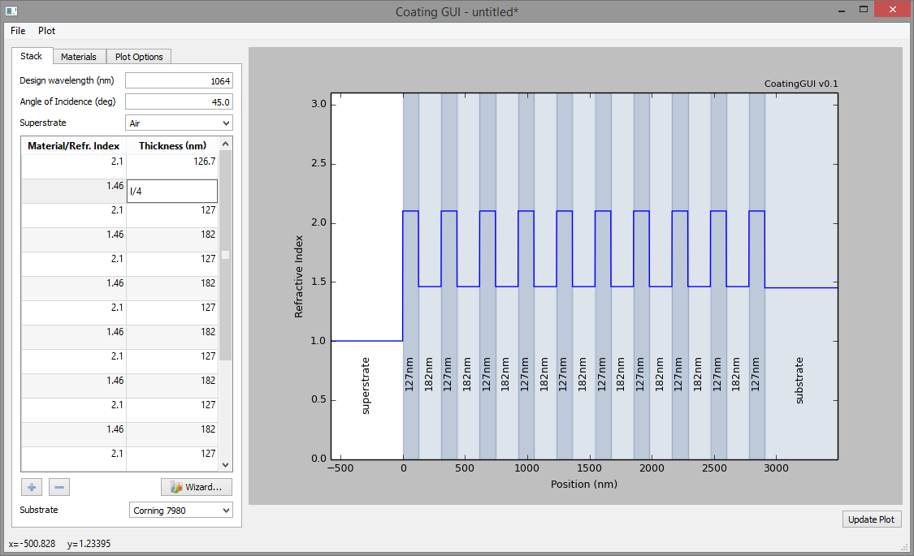
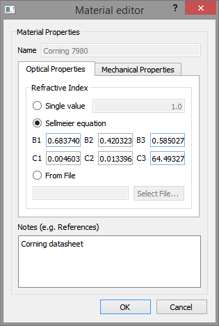

dielectric / CoatingGUI
=======================

Dielectric mirror coating simulation tool

The goal of this project is to provide an easy interface for coating
simulations, tailored to the needs of the gravitational wave community.
Especially, this means that this project is focussed on rather simple (design-
wise) single-wavelength coatings rather than e.g. dispersion-optimised
coatings. However, it aims to include coating thermal noise calculations.

Status
------
- basic work flow implemented
- optical part more or less complete
- room-temperature Brownian thermal noise calculation

Screenshots
-----------

Plot of reflectivity vs. wavelength for a multi-layer, quarter-wave stack HR
coating. The table on the left is used to enter the stack. Inputs like "l/4"
or just "/4" are automatically converted to the corresponding lambda/N
thickness for the given refractive index.

Plot of the refractive index profile and electric field intensity for the
above coating, for zero degrees angle of incidence.

Thin-film and bulk materials can be defined in a graphical editor, here showing various possibilities to enter the refractive index: as a single value that is used across all wavelengths, as a Sellmeier equation, or as datapoints that are read in from a file.

---
-- Sebastian Steinlechner, 2015
